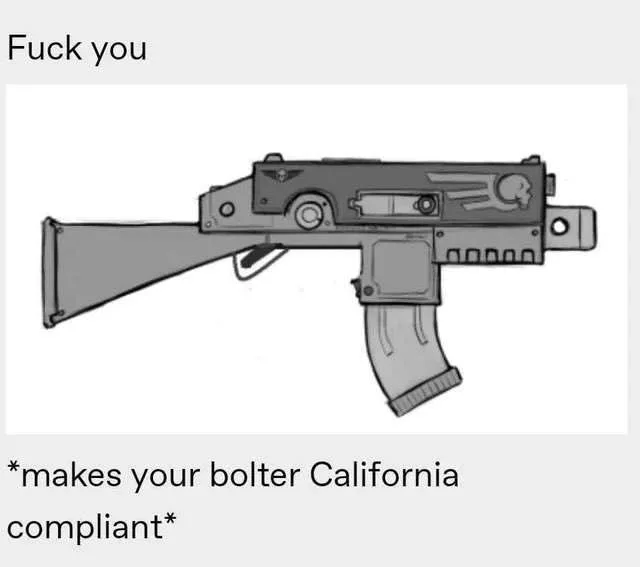

[-e8d4b6?logo=github&logoColor=e18bbc&labelColor=gray&color=e8d4b6)](/DarktideWeaponCustomizationOwO/ "OwO Repository README on GitHub Pages")
[-e8d4b6?logo=github&logoColor=86d37a&labelColor=gray&color=e8d4b6)](https://github.com/Backup158/DarktideWeaponCustomizationOwO/blob/main/docs/parts_added.md "Parts added page when displayed directly on the repository.")
[-e8d4b6?logo=github&logoColor=e18bbc&labelColor=gray&color=e8d4b6)](https://backup158.github.io/DarktideWeaponCustomizationOwO/parts_added.html "Parts added page when displayed on GitHub Pages")

> [!WARNING]
> 
> THIS IS THE PAGE FOR THE DEPRECATED WEAPON CUSTOMIZATION
> \
> THIS PAGE IS *ONLY* UP FOR ARCHIVE PURPOSES

# ***Notices youw pawts*** (Parts I added)
Parts are prefixed with `OwO` in the customization menu.

> **Part**: Weapons available
> 
> &emsp; Description

## Ranged

### Muzzles

- **Suppressors**: Infantry/Braced/Vigilant Autoguns, Bolter, Bolt Pistol, Infantry/Helbore/Recon Lasguns, Heavy Laspistols, Combat Shotguns, Exterminator Shotguns, Quickdraw Stub Revolvers  \
  &emsp; 1 and 2 are generic suppressors  \
  &emsp; 3 is based on the PBS-1  \
  &emsp; 4 and 5 are different generic suppressors, but they're bigger and more metallic
- **Lasgun Condom**: Infantry/Braced/Vigilant Autoguns, Infantry/Helbore/Recon Lasguns  \
  &emsp; To cover up the heat discoloring. Aligned for Helbore-based barrels.
- **Muzzle Brake**: Infantry/Braced/Vigilant Autoguns, Bolter, Bolt Pistol, Infantry/Helbore/Recon Lasguns  \
  &emsp; Anti-Materiel Rifle muzzle brake based on the Barrett M82. Use it with the MT Single Stubber barrels.

### Barrels
- **Dreg Gunner Barrel**: Braced/Infantry/Vigilant Autoguns
- **M16 Barrels**: Infantry/Braced/Vigilant Autoguns  \
&emsp; 2 versions based on the a1. 1 on the a2. The a1 variants are very scuffed lol.  \
&emsp; Regular variants are aligned with EOTech holographic sights. By aligned, I mean the front post is aligned with the reticle. Kinda like absolute cowitnessing but without the rear sight (so not really cowitness lol). Pretend you have a rear flip sight flipped down, I guess.  \
&emsp; Tall variants are aligned with the Prismatic Sights and M16 Carryhandle Sights.  \
&emsp; No post variants have no front post. The front post blocks most other sights, so I recommend using these for those.
- **Wooden Helbore Barrels**: Helbore Lasguns  \
&emsp; Based on the MAS-49 
- **Plasma Rifle Barrels**: Helbore Lasguns  \
&emsp; Adds rifle barrels with plasma coils in the center.  \
&emsp; &emsp; Variants using Helbore Lasgun barrels, Infantry Lasgun barrels, and Combat Shotgun barrels (named "Sniper")
- **Short Shotgun Barrels**: Bolt Pistol  \
&emsp; Short variants that extend the barrel a little. Super short variants extend it a little less (wow such detail).
- **Shotgun Barrel Extension**: Snubnosed Revolver  \
&emsp; Adds short and long variants.  \
&emsp; &emsp; Short fits typical revolver barrel length.  \
&emsp; &emsp; Long goes a bit beyond that.
- **SMG Barrels**: Autopistol, Autoguns  \
&emsp; Based on the HK MP5  \
&emsp; &emsp; MP5 Navy, MP5K, MP5SD, MP5SD HECU, MP5 MLI, MP5 Surefire Light  \
&emsp; &emsp; MP5SD HECU is used by Half Life 1 HECU Marines  \
&emsp; On Autoguns, front post is aligned to the MT Autopistol Sight.  \
&emsp; On Autoguns, the Navy barrel is best used with the Braced Autogun Receivers.  \

### Foregrips
- **Tactical Foregrips**: Infantry/Braced/Vigilant Autoguns, Combat Shotguns, Exterminator Shotguns  \
&emsp; Adds Angled Foregrips  \
&emsp; &emsp; Based on the iconic Magpul angled grip  \
&emsp; &emsp; Some generic slanted grips
- **Straight Foregrips**: Infantry/Braced/Vigilant Autoguns, Combat Shotguns, Exterminator Shotguns  \
&emsp; Adds Generic Grips, Braced Autogun Grips, Bolter Grips, Laspistol Grips, Flamer Grips, Knife Handle Grips (Normal and Stubby), Ogryn Cleaver Grips, "Devil's Claw" Combat Sword Grips  \
&emsp; Foregrips perpendicular to the barrel, which will clip with your off hand (this is why the MT plugin uses slanted foregrips).

### Bayonets
- **Dreg Gunner Bayonet**: Infantry/Braced/Vigilant Autoguns  \
&emsp; Only really aligned with the Dreg Gunner Barrel
- **Historical Pack**: Infantry/Braced/Vigilant Autoguns, Helbore Lasguns.  \
&emsp; Based on US M7 Bayonet, German Seitengewehr 98, and French Épée-Baïonnette Modèle 1888
- **Underbarrel Grenade Launchers**: Braced/Infantry/Vigilant Autoguns, Bolter, Infantry/Helbore/Recon Lasguns  \
&emsp; Based on M203 and GP25

> [!WARNING]
> 
> KNOWN ISSUE: Both variants will steal muzzle flashes from infantry autoguns

- **Underbarrel Shotguns**: Braced/Infantry/Vigilant Autoguns, Bolter, Infantry/Helbore/Recon Lasguns  \
&emsp; Based on the Knight's Armament Company Masterkey and the M26-MASS (Modular Accessory Shotgun System)  \
&emsp; &emsp; Masterkey includes smaller and larger variants

> [!WARNING]
> 
> KNOWN ISSUE: Both variants sometimes steal muzzle flashes from bullet-based weapons

### Receivers
- **Helbore Body**: Infantry/Braced/Vigilant Autoguns  \
&emsp; Replaces the receiver with the Helbore lasgun receivers

> [!WARNING]
> 
> I would *strongly* recommend only using these for screenshots. Making things work right in actual gameplay in terms of animation is... quite a mountain to climb.

### Receiver Accessories
Additional slot to add to or replace the original receiver. These can get super janky when using non-default parts so watch out. For variants that use a different base for the receiver, animations may not look right.
- **Vertically Challenged Bolter Receiver**: Spearhead Boltgun  \
&emsp; Variants  \
&emsp; &emsp; Smol Bolter (RAW): Whatever receiver you selected gets squished, as well as everything else connected automatically   \
&emsp; &emsp; Smol Bolter: Only receiver is squished, with some manual adjustments   \
&emsp; Makes the gun and magazine vertically shorter. This one is just janky all around.  \
&emsp; To avoid arrest, use with the 'Cadia' Complaint grips from the MT plugin.

> [!WARNING]
> 
> KNOWN ISSUE: The RAW versions have unusable scopes. There's way too many scopes to manually fix, especially considering that this attachment started off as a joke. They work fine on the other variants (those have fucky barrels and float in your hands). Such is the way of tradeoffs.

- **Bolt Action**: Infantry/Braced/Vigilant Autoguns, Helbore Lasguns  \
&emsp; Adds a grip to the back to mimic a bolt
- **MAS-49 Dovetail Rail**: Infantry/Braced/Vigilant Autoguns, Helbore Lasguns  \
&emsp; Makes the rear blockier and metallic... er  \
- **Massive Slide**: Heavy Laspistols  \
&emsp; (WIP) Makes the top a giant slide. Moves magazine inside the grip (with a little bulge :3). Be warned when using this because I only spent an hour before deciding I didn't care enough.  \
&emsp; Fallout 4 10mm lookin ass mf

> [!WARNING]
> 
> KNOWN ISSUE: Has a random magazine in first person

- **Slim Slide**: Heavy Laspistols  \
&emsp; (WIP) Makes the top a shorter, less wide slide. Moves magazine inside the grip (with a little bulge :3). Be warned when using this because I gave up after a few hours of making this.

> [!WARNING]
> 
> KNOWN ISSUE: Floating default parts (trigger, glowing magazine well, and switches on the side)

### Sights
- **Ladder Aperture Sights**: Helbore Lasguns  \
&emsp; Based on WWI era iron sights. No front posts though so good luck aiming with just the U notch.  \
&emsp; Includes very shoddily made MAS49 inspired sights. These look ugly as sin since the receiver is so wide and I'm too lazy to resize them.
- **AK Irons**: Infantry/Braced/Vigilant Autoguns  \
&emsp; Adjustable rear notch sight  \
&emsp; Aligned for the long Braced Autogun barrel with the Infantry/Braced receiver  \
&emsp; Includes variant with dust cover (that I wish I could make wider). I also left two scuffed variants that I made before I realize there was already an elevation ladder in the game lmao.
- **M16 Carry Handle Irons**: Infantry/Braced/Vigilant Autoguns  \
&emsp; Versions with and without the rear elevation wheel since I don't think a1's have them.  \
&emsp; Sight aligned with M16 Barrels (Tall).
- **Holographic Sights with optional Magnifier**: Braced/Infantry/Vigilant Autoguns, Recon Lasguns, Bolter, Bolt Pistol, Combat Shotguns, Exterminator Shotguns, Snubnosed Revolvers  \
&emsp; Based on EOTech HWS and Vortex Razor AMG.  \
&emsp; Adds standalone holographic sight, holo with magnifier to the side, and holo with magnifier lined up (with options for 2 zoom levels).  \
&emsp; You can choose all 3 sight pictures by using the sight_2 options from the MT Plugin.  \
&emsp; Holo with magnifier lined up includes variants for zoom.  \
&emsp; Includes short variants that doesn't clip with the receiver, but blocks more of the sight picture.  \
&emsp; Supports the Volleygun receivers from Syn's Edits.
- **Prismatic Sights with optional Red Dot Sight**: Braced/Infantry/Vigilant Autoguns, Infantry/Helbore/Recon Lasguns, Bolter, Bolt Pistol, Combat Shotguns, Exterminator Shotguns, Snubnosed Revolvers  \
&emsp; Based on Trijicon ACOG (Advanced Combat Optical Gunsight) and SUSAT (Small Unit Small Arms, Trilux).  \
&emsp; Adds standalone prism sight and prism sight with a RDS stacked on top (both having options for 2 zoom levels).  \
&emsp; &emsp; Includes backwards variants where it's placed closer to the back of the weapon; certain (small) weapons don't have enough space to do this so both positions are the same.  \
&emsp; &emsp; Stacked sights have variants to aim through the main sight or the red dot (top).  \
&emsp; ACOGs don't have bullet drop compensation crosshair ticks.  \
&emsp; &emsp; Uses the default Darktide reflex pictures, equipped through sight_2 options.  \
&emsp; SUSATs use the German post, obelisk-shaped reticle (No options).  \
&emsp; Sights are aligned with M16 Barrels (Tall)  \
&emsp; Supports the Volleygun receivers from Syn's Edits.

> [!WARNING]
> 
> KNOWN ISSUE: SUSATs will steal the shot trails from lasguns and shotguns (???).

- **Classic Telescopic Scopes**: Infantry/Braced/Vigilant Autoguns, Helbore Lasguns  \
&emsp; Soviet PU Scopes  \
&emsp; &emsp; Uses German #1 style reticle. The one that looks like a T

### Sight 2
- **Alternative Viewmodels**: Braced/Infantry/Vigilant Autoguns, Autopistol, Bolter, Bolt Pistol, Infantry/Helbore/Recon Lasguns, Laspistol, Combat/Double Barrel Shotguns, Stub Revolvers  \
&emsp; Point shooting, DOOM aiming, CS:S Zoom (think SG-552 Commando zoom), and Hipfire aim  \
&emsp; Equipped in the helper sight section  \
&emsp; These change how you hold the gun while ADSing while keeping the physical appearance of the scope on your gun.
- **Classic Crosshair Reticles**: Braced/Infantry/Vigilant Autoguns, Helbore Lasguns
&emsp; Based on
&emsp; &emsp; German Reticle #1 (with high variant)
&emsp; Meant to work with Classic Telescopic Scopes

### Grips
- **Fin Grips**: Infantry/Braced/Vigilant Autoguns  \
&emsp; Grip with a wedge sticking out the back to avoid having a grip that "protrudes conspicuously beneath the action of the weapon."  \
&emsp; In compliance with Cadian Penal Code section 30515
- **Invisible Grip**: Infantry/Braced/Vigilant Autoguns  \
&emsp; For use with the Helbore stock when using the Helbore receiver

### Stocks
- **Straight Grip and Stock**: Helbore Lasguns  \
&emsp; Recon stocks with revolver grips, based on Elysian Drop Troop sniper lasguns.  \
&emsp; Anti-materiel rifle stocks, based on the Barrett M82 with the rear grip.  \
&emsp; These will clip into your hands during regular use, which why the other plugins use slanted grips
- **Tactical Stocks**: Braced/Infantry/Vigilant Autoguns, Autopistols, Infantry Lasguns, Bolter, Bolt Pistol, Combat Shotguns, Exterminator Shotguns   \
&emsp; Skeletal stock  \
&emsp; Telescopic stock (pushed in)  \
&emsp; Folded stocks: Stock attached to a hinge and folded to the left or right  \
&emsp; Folded stocks (natural): Stocks with hinges built-in. Folded left/right/under
- **Kalashnikov Stocks**: Braced/Infantry/Vigilant Autoguns  \
&emsp; Bigger stocks rotated to resemble the stocks on Kalashnikov rifles  \
&emsp; Includes compact variants for shotgun stocks
- **Straight Grip**: Combat Shotguns  \
&emsp; Same options from the Straight Foregrips but reused as a stock

> [!WARNING]
> 
> QUIRK: Because it's a reused part, that means you cannot mix differently-sized straight foregrips and grips (stocks), otherwise it may use the wrong sizes.
> For example, using an straight ogryn foregrip with a lasgun grip (stock) will make a giant straight ogryn foregrip. Using a straight laspistol foregrip with an MT plasmagun grip (stock) is fine, however.
> Fixing this would take much more time and effort I'd like to put into this single attachment, especially when most of us just us the angled foregrips

- Also `stock_2`, **Big Stocks!**: Combat Shotguns, Exterminator Shotguns  \
&emsp; Rifle stocks sized up

### Magazines
- **Flat Magazines**: Infantry/Helbore/Recon Lasguns  \
&emsp; Lasgun magazine and slanted bottom autogun magazine.  \
&emsp; Bottom is flush with the bottom of the magazine mouth thing on the receiver.
- **Recon Rear Magazines**: Helbore Lasguns  \
&emsp; For use with the Elysian grip-stock.
- **Jungle Magazines**: Infantry/Braced/Vigilant Autoguns  \
&emsp; Two magazines taped together  \
&emsp; &emsp; Variants for each autogun magazine  \
&emsp; &emsp; Each variant has options for the extra mag to be on the left/right and flipped/rightside up.
- **Mag Assists**: Infantry/Braced/Vigilant Autoguns  \
&emsp; Based on the Magpul magazine pulls (the Magpul magpulls)

> [!NOTE]
> 
> These things are absolutely cursed and only exist by sticking to the final bullet in the magazine. This means the magpul will move as you shoot the gun lmfao.
> \
> Due for a rework but I kinda don't care rn.

- **Plasma Magazines**: Helbore Lasguns  \
&emsp; Literally just the magazines from the plasma gun.  \
&emsp; Variants for just being stuck directly into the receiver and for being attached to a smaller magazine (which doesn't work in-game but shows up in previews)

### Flashlights
- **Trigger Guard Laser**: Heavy Laspistols, Quickdraw Stub Revolvers  \
&emsp; (WIP) Moves the laser pointer in front of the trigger guard.

> [!IMPORTANT]
> 
> The lasers will NOT work unless you modify files in weapon customization manually.
> \
> By default, they appear as flashlights. I'll try and see if there's a better way of doing this.
 
## Melee

### Heads
- **Tactical Axe Spike**: Combat/Tactical Axes, Thunder Hammers, Crusher, Delver's Pickaxes, Shock Maul, Arbites Shock Maul  \
&emsp; Spike on the back of the tactical axe head. Fills in the holes in the blades.

> [!WARNING]
> 
> KNOWN ISSUE: Variants 2/3/M do not have the spike aligned properly, so there's a second axe head in the middle of these

- **Polearm Heads**: Thunder Hammers, Crusher, Delver's Pickaxes, Shock Maul, Arbites Shock Maul  \
&emsp; Based on Becs de Corbin, Lucerne Hammers, and Poleaxes  \
&emsp; &emsp; Becs de Corbin/The Crow's Beak: A hammer head with a spike on top and a curved pick in the back  \
&emsp; &emsp; Lucerne Hammer: Like a Bec de Corbin with a longer, thinner back pick and with a hammer head that typically has more protrusions  \
&emsp; &emsp; Poleaxes/Pollaxes: An axe head with a wide spike on top and a hammer in the back

> [!TIP]
> 
> Recommended to be used with the Invisible Connector

- **Crutches**: Thunder Hammers, Crusher  \
&emsp; Yes, the kind people with broken legs use  \
&emsp; Based on the kinds that go into the armpit (axillary) and the ones that go under the forearm to the elbow (Loftstrand)

> [!TIP]
> 
> Recommended to be used with the Invisible Connector

### Body
- **Rapier Blade**: Catachan "Devil's Claw" Swords, Dueling Swords  \
&emsp; Thin, straight blades
- **Historical Knives**: Combat Blades  \
&emsp; Based on the M1917 Trench Dagger, Gerber Mk II, Indonesian karambits, and tanto blades.  \
&emsp; Karambits come in regular/short and curved forwards/backwards (and they're all very scuffed lol)  \
&emsp; Tantos are basically the MT Combat Sword blades but skinnier and shorter, so I didn't bother aligning them outside the default case.

### Blades
- **Slim Blades**: Power Swords, Catachan "Devil's Claw" Swords, Shock Maul, Arbites Shock Maul, Shock Maul and Suppression Shield \
&emsp; 1h Power Sword blades and "Devil's Claw" blades scaled down  \
&emsp; &emsp; Flat: Less thick, but same width and height  \
&emsp; &emsp; Slim: Less thick and wide, but same height  \
&emsp; &emsp; Grip (G) variants of both: Also halves the thickness of whatever hilt you equipped  \
&emsp; Grip (G) variants are unpatched for most other grips so caveat emptor (main for MT Ogryn grips)

> [!TIP]
> 
> For the Arbitrator's Shield and Maul, recommended to be used with the Invisible Connector

### Connectors
- **Invisible Connector**: Thunder Hammers, Crusher, Shock Maul, Arbites Shock Maul, Shock Maul and Suppression Shield  \
&emsp; Makes the connector invisible. That's it. \
&emsp; It doesn't extend the shaft on its own; it's meant to be used with other parts (namely the tacax spikes)

### Shafts
- **Long Hammer Shafts**: Thunder Hammers, Crusher  \
&emsp; Longer shaft (held at the bottom)  \
&emsp; When used with an Invisible Connector, it's about forehead height for a max height character.
- **Long Ogryn Shafts**: Delver's Pickaxes  \
&emsp; Longer shaft (held at the bottom)  \
&emsp; The head is around nose level.

### Pommels
- **Shovel Handles**: Sapper Shovels  \
&emsp; Primarily based on contemporary military E-Tools \
&emsp; &emsp; Tri-fold \
&emsp; &emsp; D-Rings \
&emsp; &emsp; T-Rings (wooden and metallic)

> [!WARNING]
> 
> KNOWN ISSUE: Note that these only work on some head/grip combinations, and it's different for each pommel.
> \
> Shovels are cursed (not really I'm just a lazy bitch).

### Front Guard
- **Front Guard**: Combat Blades  \
&emsp; New slot. Curved hilt in front of the grip to protect your fingers.  \
&emsp; Includes knuckle duster variants, where you have 1-4 small guards in front.
