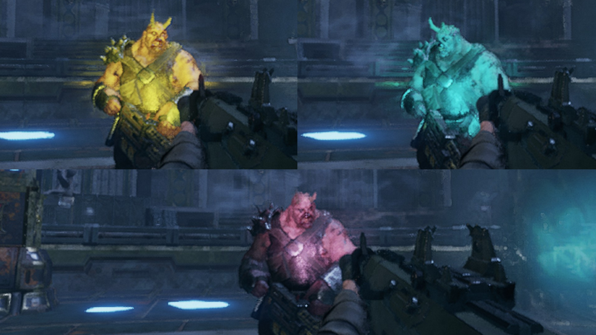
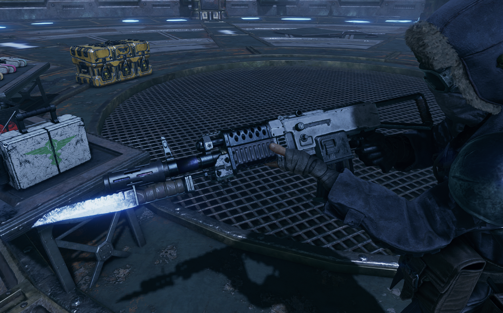
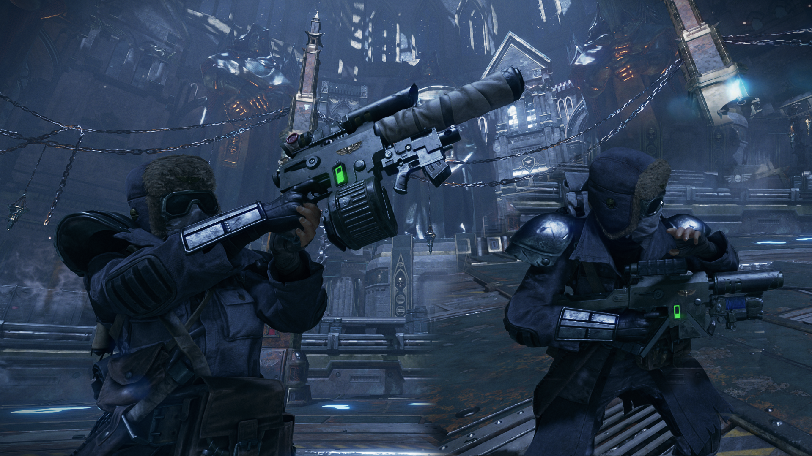
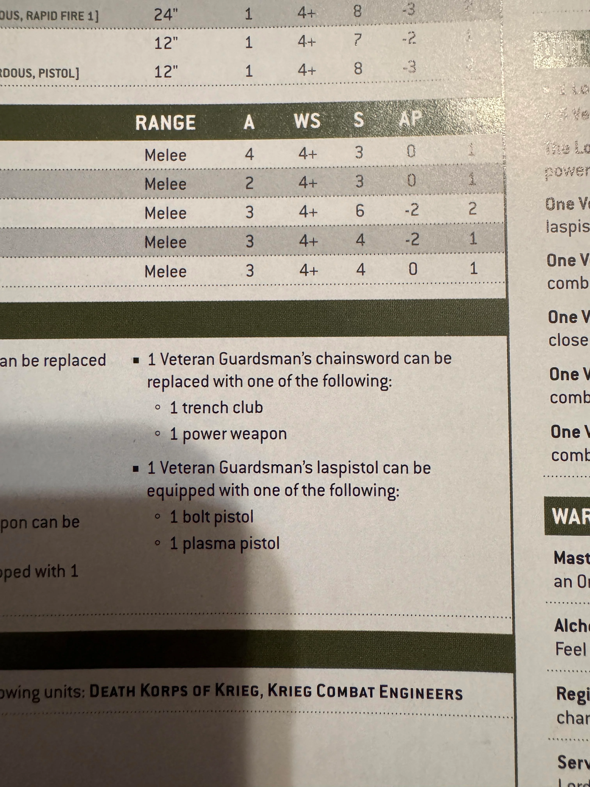
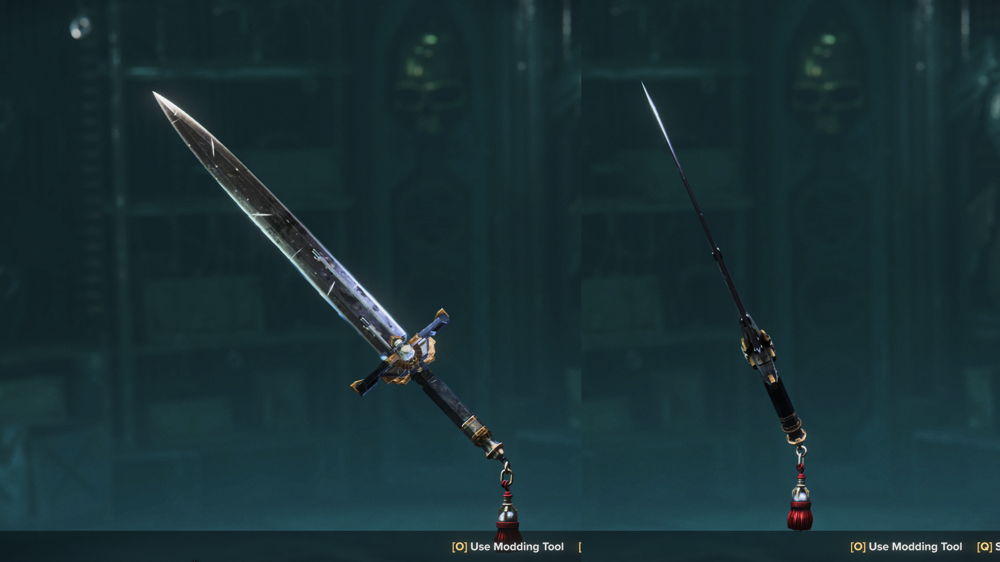
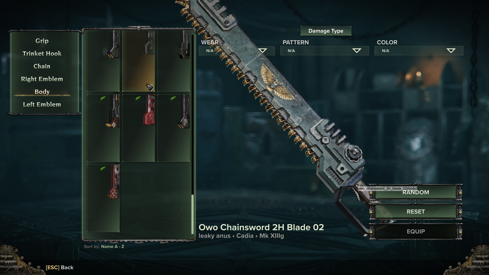

[-e8d4b6?logo=github&logoColor=e18bbc&labelColor=gray&color=e8d4b6)](./ "OwO Repository README on GitHub Pages")
[-e8d4b6?logo=github&logoColor=86d37a&labelColor=gray&color=e8d4b6)](https://github.com/Backup158/DarktideWeaponCustomizationOwO/blob/main/docs/parts_added_reborn.md "Parts added page when displayed directly on the repository.")
[-e8d4b6?logo=github&logoColor=e18bbc&labelColor=gray&color=e8d4b6)](https://backup158.github.io/DarktideWeaponCustomizationOwO/parts_added_reborn.html "Parts added page when displayed on GitHub Pages")

# ***Notices youw pawts*** (Parts I added)
In the customization menu, parts will be in sections named `Ostracized without Objection (OwO)` or `OwO - <some_name>`

> ### **Part**
> - *Weapons*: Weapons available
> - Description

# Ranged
## Special/Flashlight
All flashlights come with color and beam power variants. Each combination is its own category, which each of the following types of flashlight included.

- Colors (10):
    - Green
    - Red
    - Blue
    - Magenta
    - Cyan
    - Yellow
    - Pink
    - Andy
    - Leyley
    - Custom - This is set in the Mod Options (Requires DMF v26.08.19+)
- Beam Strengths (4):
    - Narrow
    - Narrow (Cool) - This reduces the color temperature, slightly shifting it
    - Weak
    - Default

> [!TIP]
> 
> There's... a lot of these...
> There are 4 * 10 = 40 combinations of Color and Beam Strength. So that's how many categories thare are in the menu.
> And then each category holds each flashlight model
> That's rough

### **Colored Default Flashlights**
- *Weapons*: All ranged weapons
- Each model of flashlight (5) for each of the color and beam types, plus one model that's supposed to be invisible
- That means theres 40 beams * (5 + 1) models = 240 of these flashlights! Scrolling through the menu is horrible. I am not sorry.

### **MP5 Flashlights**
- *Weapons*: Infantry/Braced/Vigilant Autoguns, Shredder Autopistol, Spearhead Boltguns, Bolt Pistols, Infantry/Helbore/Recon Lasguns, Heavy Laspistols, Quickdraw Stub Revolvers
- Sits on top of the sight rail
> [!WARNING]
> 
> Nonfunctional

> [!TIP]
> 
> Don't use with sights lol
> Since it sits on the sight rail, it'll block your view

### **Tactical Flashlights**
- *Weapons*: Infantry/Braced/Vigilant Autoguns, Shredder Autopistol, Spearhead Boltguns, Bolt Pistols, Infantry/Helbore/Recon Lasguns, Heavy Laspistols, Quickdraw Stub Revolvers
- Big flashlight (like a handheld) but on the gun
> [!WARNING]
> 
> Nonfunctional

## Bayonet
### **AK Style Helbore Bayonets**
- *Weapons*: All ranged weapons
- The slashing Helbore bayonets but flipped upside down
- Mimicking the style of Soviet Type 1 and Type 2 AKM Bayonets
> [!WARNING]
> 
> Not aligned for all weapons

## Underbarrel Weapon
### **Veteran Guardsman Laspistol Wargear**
- *Weapons*: Heavy Laspistols
- Underbarrel Plasma Pistols (32) and Bolt Pistols (2)
  - Plasma Pistols have a variant for various combinations of receivers (4) and barrels (8)
  - Bolt Pistols have a variant for each magazine
- Yes, you read that correctly lol. These are based on a misprint in one of the 10th edition rulebooks

## Muzzle
### **Suppressors**
- *Weapons*: Infantry/Braced/Vigilant Autoguns, Shredder Autopistol, Spearhead Boltguns, Bolt Pistols, Infantry/Helbore/Recon Lasguns, Heavy Laspistols, Quickdraw Stub Revolvers
- Comes in normal and slim variants. The categories are made based on these main types.
  - Double Suppressor (2)
  - PBS-1 (2): The second variant is the same as the first, but it doesn't hide the base muzzle used for positioning
  - Heavy Metal (2)
> [!WARNING]
> 
> 1. Muzzle flash is at the base of the suppressor, not actual muzzle part. Trying to move that around seemed impossible
> 2. PBS-1 has a muzzle in the middle that clips. It's a base to keep the muzzle flash, but hiding it has been oddly difficult to get working

## Barrel
### **Contemporary Barrels**
- *Weapons*: Autoguns
- **Kalashnikov Barrels**
  - Shortened Braced Autogun Barrels
  - They come in Short (Rocks Glass) and Shorter (Shot Glass)

## Stock
### **Tactical Stocks**
- *Weapons*: Infantry/Braced/Vigilant Autoguns, Shredder Autopistol, Spearhead Boltguns, Bolt Pistols, Infantry/Helbore/--- Lasguns
- Comes in normal and slim variants
  - Skeletal Stock
  - Naturally folded stocks
    - Left (2)
    - Wire stock folded under
> [!WARNING]
> 
> Do not use with Helbores yet

## Magazine
### **Magazines**
- *Weapons*: Infantry/Braced/Vigilant Autoguns,
- AK Extended Mag
> [!WARNING]
> 
> Nonfunctional

## Sight
### **Iron Sights**
- *Weapons*: Infantry/Braced/Vigilant Autoguns,
- AK Irons
> [!WARNING]
> 
> Works but alignment can decide to not work

# Melee
## Blade/Body
### **Slim Blades**
- *Weapons*: Power Swords, Power Falchions, Mechanicus Power Swords, Relic Blades, Blaze Force Swords, Blaze Force Greatsword, "Devil's Claw" Sword, Heavy Sword, Dueling Sword
- Comes in Flat and Slim, each with Grip variants
  - Flat: Blade's cutting edge is slimmed down
  - Slim: Blade is less wide and its cutting edge is slimmed down
  - Grip Variant: Also shrinks the grip

> [!WARNING]
> 
> Some of them are just flipped backwards. Despite a few months of effort, they aren't cooperating. Therefore they are unholy (tbh it probably just means I need to remake them).

### **Chainsword Blades**
- *Weapons*: Assault Chainswords, Heavy Eviscerators
- Allows each weapon to use the other's body/chain

## Rear Head
### **Rear Spike**
- *Weapons*: Combat Axes, Tactical Axes
- Puts a spike on the back
> [!WARNING]
> 
> Nonfunctional